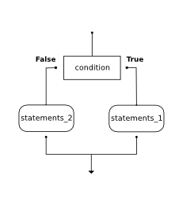

..  Copyright (C)  Brad Miller, David Ranum, Jeffrey Elkner, Peter Wentworth, Allen B. Downey, Chris
    Meyers, and Dario Mitchell.  Permission is granted to copy, distribute
    and/or modify this document under the terms of the GNU Free Documentation
    License, Version 1.3 or any later version published by the Free Software
    Foundation; with Invariant Sections being Forward, Prefaces, and
    Contributor List, no Front-Cover Texts, and no Back-Cover Texts.  A copy of
    the license is included in the section entitled "GNU Free Documentation
    License".

.. qnum::
   :prefix: select-4-
   :start: 1

.. index:: heading, body, selection, if, else, pass, compound statement, conditional statement
   statement; if
   statement; pass
   comparison; numbers
   single:  <; numbers
   single:  <=; numbers
   single:  >; numbers
   single:  >=; numbers
   single:  ==; numbers
   single:  !=; numbers

The ``if`` Statement
--------------------

.. youtube:: HriDtn-0Dcw
    :height: 315
    :width: 560
    :align: left

In order to write useful programs, we almost always need the ability to check
conditions and change the behavior of the program accordingly. **Selection statements**, sometimes
also referred to as **conditional statements**, give us this ability. The simplest form of selection is the **if statement**.

The following example asks the user for an integer, and tells the user
whether the integer is even or odd using an ``if`` statement.

.. activecode:: ch05_4

    x = int(input('Enter an integer:'))

    if x % 2 == 0:
        print(x, "is even")
    else:
        print(x, "is odd")

This example works by using the modulus operator to compute the remainder of a division by 2. The program compares the
result of the modulus operation with the number ``0``; if the two values are equal, the program concludes that the number is even;
otherwise, it must be odd.

An ``if`` statement has the following form:

.. sourcecode:: python

    if CONDITION:
        STATEMENTS_1        # executed if condition evaluates to True
    else:
        STATEMENTS_2        # executed if condition evaluates to False

Here's a flowchart that shows how the flow branches to execute either STATEMENTS_1
or STATEMENTS_2, depending on the outcome of the condition:

The CONDITION is a comparison between two values that evaluates to either ``True`` or ``False``. If the condition is
True, then the immediately following indented statements get executed. Otherwise, the statements indented under the
``else`` clause get executed. Since there are two possible paths of execution, the ``if`` statement performs what is
called **binary selection**.

The equality operator used in the example above, ``==``, compares two values and produces the value **True** if they are
equal, and **False** if they are not. The ``==`` operator is one of six common **comparison operators**; the others are:

.. sourcecode:: python

    x != y               # x is not equal to y
    x > y                # x is greater than y
    x < y                # x is less than y
    x >= y               # x is greater than or equal to y
    x <= y               # x is less than or equal to y

Although these operations are probably familiar to you, the Python symbols are
different from the mathematical symbols. A common error is to use a single
equal sign (``=``) instead of a double equal sign (``==``). Remember that ``=``
is an assignment operator and ``==`` is a comparison operator. Also, there is
no such thing as ``=<`` or ``=>``.

As with other compound statements like ``for``, the ``if`` statement consists of a header line and a body. The header
line begins with the keyword ``if`` followed by a *boolean expression* and ends with a colon (:). The more indented
statements that follow are called a **block**.

Each of the statements inside the first block of statements is executed in order if the boolean
expression evaluates to ``True``. The entire first block of statements
is skipped if the boolean expression evaluates to ``False``, and instead
all the statements under the ``else`` clause are executed.

There is no limit on the number of statements that can appear under the two clauses of an
``if`` statement, but there has to be at least one statement in each block.

.. admonition:: Optional Lab

    * `Approximating Pi with Simulation <../Labs/montepi.html>`_ In this guided lab exercise we will work
      through a problem solving exercise related to approximating the value of pi using random numbers.

**Check your understanding**

.. mchoice:: test_question6_4_1
   :practice: T
   :answer_a: Just one.
   :answer_b: Zero or more.
   :answer_c: One or more.
   :answer_d: One or more, and each must contain the same number.
   :correct: c
   :feedback_a: Each block may also contain more than one.
   :feedback_b: Each block must contain at least one statement.
   :feedback_c: Yes, a block must contain at least one statement and can have many statements.
   :feedback_d: The blocks may contain different numbers of statements.

   How many statements can appear in each block (the if and the else) in a conditional statement?

.. mchoice:: test_question6_4_2
   :practice: T
   :answer_a: TRUE
   :answer_b: FALSE
   :answer_c: TRUE on one line and FALSE on the next
   :answer_d: Nothing will be printed
   :correct: b
   :feedback_a: TRUE is printed by the if-block, which only executes if the conditional (in this case, 4+5 == 10) is true.  In this case 5+4 is not equal to 10.
   :feedback_b: Since 4+5==10 evaluates to False, Python will skip over the if block and execute the statement in the else block.
   :feedback_c: Python would never print both TRUE and FALSE because it will only execute one of the if-block or the else-block, but not both.
   :feedback_d: Python will always execute either the if-block (if the condition is true) or the else-block (if the condition is false).  It would never skip over both blocks.

   What does the following code print (choose from output a, b, c or nothing)?

   .. code-block:: python

     if 4 + 5 == 10:
         print("TRUE")
     else:
         print("FALSE")

.. mchoice:: test_question6_4_3
   :practice: T
   :answer_a: Output a
   :answer_b: Output b
   :answer_c: Output c
   :answer_d: Output d
   :correct: c
   :feedback_a: Although TRUE is printed after the if-else statement completes, both blocks within the if-else statement print something too.  In this case, Python would have had to have skipped both blocks in the if-else statement, which it never would do.
   :feedback_b: Because there is a TRUE printed after the if-else statement ends, Python will always print TRUE as the last statement.
   :feedback_c: Python will print FALSE from within the else-block (because 5+4 does not equal 10), and then print TRUE after the if-else statement completes.
   :feedback_d: To print these three lines, Python would have to execute both blocks in the if-else statement, which it can never do.

   What does the following code print?

   .. code-block:: python

     if 4 + 5 == 10:
         print("TRUE")
     else:
         print("FALSE")
     print("TRUE")

   ::

      a. TRUE

      b.
         TRUE
         FALSE

      c.
         FALSE
         TRUE
      d.
         TRUE
         FALSE
         TRUE
