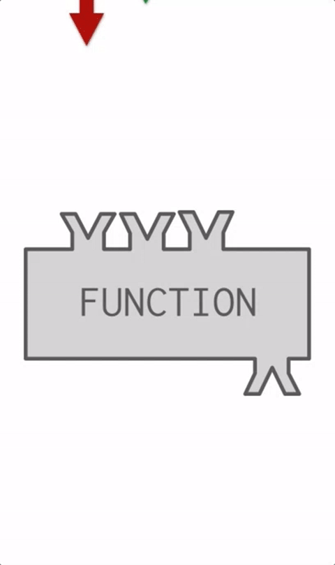

..  Copyright (C)  Brad Miller, David Ranum, Jeffrey Elkner, Peter Wentworth, Allen B. Downey, Chris
    Meyers, and Dario Mitchell.  Permission is granted to copy, distribute
    and/or modify this document under the terms of the GNU Free Documentation
    License, Version 1.3 or any later version published by the Free Software
    Foundation; with Invariant Sections being Forward, Prefaces, and
    Contributor List, no Front-Cover Texts, and no Back-Cover Texts.  A copy of
    the license is included in the section entitled "GNU Free Documentation
    License".

.. qnum::
   :prefix: func-4-
   :start: 1

Returning a value from a function
=================================

.. youtube:: zbFZIlROWwc
    :divid: vid_funcretval
    :height: 315
    :width: 560
    :align: left

Not only can you pass a parameter value into a function, a function can also produce a value. You have already
seen this in some previous functions that you have used. For example, ``len`` takes a list or string as a parameter
value and returns a number, the length of that list or string. ``range`` takes an integer as a parameter value and
returns a list containing all the numbers from 0 up to that parameter value.

As you've already seen, not all functions return values. In many languages, a function that
doesn't return a value is called a **procedure**, or **void function**.

Let's start by creating a very simple mathematical function that we will
call ``square``. The square function will take one number as a parameter and return the result of squaring that
number. Here's the code to define that function, then call it to obtain the result:

.. activecode:: ac11_4_1

    def square(x):
        y = x * x
        return y

    toSquare = 10
    result = square(toSquare)
    print("The result of {} squared is {}.".format(toSquare, result))

The **return** statement is followed by an expression which is evaluated. Its result is returned to the caller as the
"fruit" of calling this function. Because the return statement can contain any Python expression we could have
avoided creating the **temporary variable** ``y`` and simply used ``return x*x``. Try modifying the square function
above to see that this works just the same. On the other hand, using **temporary variables** like ``y`` in the program
above makes debugging easier. These temporary variables are referred to as **local variables**, and we'll have more to
say about them later in this book.

Notice something important here. The name of the variable we pass as an argument --- ``toSquare`` --- has nothing to
do with the name of the formal parameter --- ``x``.  It is as if  ``x = toSquare`` is executed when ``square`` is
called. It doesn't matter what the value was named in the caller (the place where the function was invoked). Inside
``square``, its name is ``x``.  To see this, try executing it using **Show CodeLens**. 

.. tabbed:: tab_basic

    .. tab:: Question

        Write a function called ``subtract_three`` that takes an integer or any number as a parameter, and returns that number minus three.
        The activecode interpreter will check your work.

        .. activecode:: ac11_4_6
            :language: python
            :autograde: unittest
            :practice: T

            =====

            from unittest.gui import TestCaseGui

            class myTests(TestCaseGui):

                def testOne(self):
                    self.assertEqual(subtract_three(9), 6, "Testing the subtract_three function on input 9.")
                    self.assertEqual(subtract_three(-5), -8, "Testing the subtract_three function on input -5.")

            myTests().main()

    .. tab:: Solution

        Here's the solution (yours could use a parameter with a name other than ``num``)::

            def subtract_three(num):
                """Returns the value `num` - 3"""
                return num - 3

Returning Multiple Values
-------------------------

A function can return more than one value. Consider this example:

.. activecode:: ac_ret_mult

    def int_divide(num, denom):
        quotient = num // denom
        remainder = num % denom

        return quotient, remainder

    quot, rem = int_divide(8, 3)
    print(quot, rem)

The function ``int_divide`` computes both the quotient and the remainder of an integer division. It needs to return both values to
the caller, and does so by separating the two values with commas in the return statement::

    return quotient, remainder

You call such a function like this::

    quot, rem = int_divide(8, 3)

Notice how two variables appear on the left-hand side of the assignment statement, separated by commas: ``quot`` and ``rem``. 
The first variable, ``quot``, receives the first value returned in the function (``quotient``), and the second variable, ``rem``,
receives the second value.

``return`` exits the function
-----------------------------

A return statement, once executed, immediately terminates execution of a function, even if it is not the last
statement in the function. This is useful in cases where you need a function to return "early." Consider the
following example:

.. activecode:: ac11_4_2

  def safe_divide(num, denom):
      if denom == 0:
        return 0

      return num / denom

  x = safe_divide(5, 0)
  print(x)

In this example, the value of the ``denom`` parameter is ``0``, so the function returns the value ``0`` instead of
performing a division which would result in a runtime error. (Whether this is actually a good idea is the topic
of a separate discussion.)

Using return values
-------------------

So far, we have just seen return values being assigned to variables. For example, we had the line
``squareResult = square(toSquare)``. As with all assignment statements, the right hand side is executed first. It
invokes the ``square`` function, passing in a parameter value 10 (the current value of ``toSquare``). That returns a
value 100, which completes the evaluation of the right-hand side of the assignment. 100 is then assigned to the
variable ``squareResult``. In this case, the function invocation was the entire expression that was evaluated.

Function invocations, however, can also be used as part of more complicated expressions. For example,
``squareResult = 2 * square(toSquare)``. In this case, the value 100 is returned and is then multiplied by 2 to
produce the value 200. When python evaluates an expression like ``x * 3``, it substitutes the current value of x into
the expression and then does the multiplication. When python evaluates an expression like ``2 * square(toSquare)``, it
substitutes the return value 100 for entire function invocation and then does the multiplication.

To reiterate, when executing a line of code ``squareResult = 2 * square(toSquare)``, the Python
interpreter does these steps:

#. It's an assignment statement, so evaluate the right-hand side expression ``2 * square(toSquare)``.
#. Look up the values of the variables square and toSquare: square is a function object and toSquare is 10
#. Pass 10 as a parameter value to the function, get back the return value 100
#. Substitute 100 for square(toSquare), so that the expression now reads ``2 * 100``
#. Assign 200 to variable ``squareResult``

**Check your understanding**

.. mchoice:: question11_4_1
   :answer_a: You should never use a print statement in a function definition.
   :answer_b: You should not have any statements in a function after the return statement.  Once the function gets to the return statement it will immediately stop executing the function.
   :answer_c: You must calculate the value of x+y+z before you return it.
   :answer_d: A function cannot return a number.
   :correct: b
   :feedback_a: Although you should not mistake print for return, you may include print statements inside your functions.
   :feedback_b: This is a very common mistake so be sure to watch out for it when you write your code!
   :feedback_c: Python will automatically calculate the value x+y+z and then return it in the statement as it is written
   :feedback_d: Functions can return any legal data, including (but not limited to) numbers, strings, lists, dictionaries, etc.
   :practice: T

   What is wrong with the following function definition:

   .. code-block:: python

     def addEm(x, y, z):
         return x+y+z
         print('the answer is', x+y+z)

.. mchoice:: question11_4_3
   :answer_a: 25
   :answer_b: 50
   :answer_c: 25 + 25
   :correct: b
   :feedback_a: It squares 5 twice, and adds them together.
   :feedback_b: The two return values are added together.
   :feedback_c: The two results are substituted into the expression and then it is evaluated. The returned values are integers in this case, not strings.
   :practice: T

   What will the following code output?

   .. code-block:: python

       def square(x):
           y = x * x
           return y

       print(square(5) + square(5))

.. mchoice:: question11_4_4
   :answer_a: 8
   :answer_b: 16
   :answer_c: Error: can't put a function invocation inside parentheses
   :correct: b
   :feedback_a: It squares 2, yielding the value 4. But that doesn't mean the next value multiplies 2 and 4.
   :feedback_b: It squares 2, yielding the value 4. 4 is then passed as a value to square again, yeilding 16.
   :feedback_c: This is a more complicated expression, but still valid. The expression square(2) is evaluated, and the return value 4 substitutes for square(2) in the expression.

   What will the following code output?

   .. code-block:: python

       def square(x):
           y = x * x
           return y

       print(square(square(2)))

.. mchoice:: question11_4_5
   :answer_a: 1
   :answer_b: Yes
   :answer_c: First one was longer
   :answer_d: Second one was at least as long
   :answer_e: Error
   :correct: c
   :feedback_a: cyu2 returns the value 1, but that's not what prints.
   :feedback_b: "Yes" is longer, but that's not what prints.
   :feedback_c: cyu2 returns the value 1, which is assigned to z.
   :feedback_d: cyu2 returns the value 1, which is assigned to z.
   :feedback_e: what do you think will cause an error.
   :practice: T

   What will the following code output?

   .. code-block:: python

       def cyu2(s1, s2):
           x = len(s1)
           y = len(s2)
           return x-y

       z = cyu2("Yes", "no")
       if z > 0:
           print("First one was longer")
       else:
           print("Second one was at least as long")

.. mchoice:: question11_4_6
   :answer_a: square
   :answer_b: g
   :answer_c: a number
   :correct: b
   :feedback_a: Before executing square, it has to figure out what value to pass in, so g is executed first
   :feedback_b: g has to be executed and return a value in order to know what paramater value to provide to x.
   :feedback_c: square and g both have to execute before the number is printed.
   :practice: T

   Which will print out first, square, g, or a number?

   .. code-block:: python

       def square(x):
           print("square")
           return x*x

       def g(y):
           print("g")
           return y + 3

       print(square(g(2)))

.. mchoice:: question11_4_7
   :answer_a: 3
   :answer_b: 2
   :answer_c: None
   :correct: b
   :feedback_a: The function gets to a return statement after 2 lines are printed, so the third print statement will not run.
   :feedback_b: Yes! Two printed lines, and then the function body execution reaches a return statement.
   :feedback_c: The function returns an integer value! However, this code does not print out the result of the function invocation, so you can't see it (print is for people). The only lines you see printed are the ones that occur in the print statements before the return statement.
   :practice: T

   How many lines will the following code print?

   .. code-block:: python

       def show_me_numbers(list_of_ints):
           print(10)
           print("Next we'll accumulate the sum")
           accum = 0
           for num in list_of_ints:
               accum = accum + num
           return accum
           print("All done with accumulation!")

       show_me_numbers([4,2,3])

.. activecode:: ac11_4_9
   :language: python
   :autograde: unittest
   :practice: T

   **8.** Write a function called ``s_change`` that takes one string as input and returns that string, concatenated with the string " for fun.".
   ~~~~

   =====

   from unittest.gui import TestCaseGui

   class myTests(TestCaseGui):

      def testOne(self):
         self.assertEqual(s_change("Coding"), "Coding for fun." ,"Testing the function s_change with input coding")
         self.assertEqual(s_change("We go to the beach"), "We go to the beach for fun." , "Testing the function s_change with input We go to the beach")

   myTests().main()

.. activecode:: ac11_4_10
   :language: python
   :autograde: unittest
   :practice: T

   **9.** Write a function called ``decision`` that takes a string as input, and then checks the number of characters. If it has over 17 characters, return "This is a long string", if it is shorter or has 17 characters, return "This is a short string".
   ~~~~

   =====

   from unittest.gui import TestCaseGui

   class myTests(TestCaseGui):

      def testOne(self):
         self.assertEqual(decision("Well hello dolly"), "This is a short string", "Testing the function decision with input 'Well hello dolly'")
         self.assertEqual(decision("In olden days a glimps of stocking was looked on a something shocking but heaven knows, anything goes"), "This is a long string", "Testing the function decision with input 'In olden days a glimps of stocking was looked on a something shocking but heaven knows, anything goes'")
         self.assertEqual(decision("how do you do sir"), "This is a short string", "Testing the function decision with input 'how do you do sir'")

   myTests().main()
