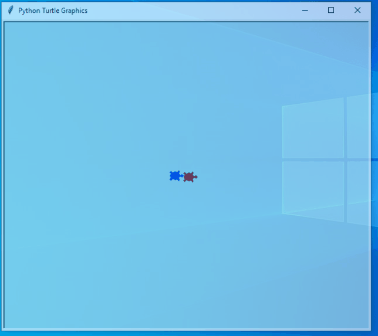

:orphan:

..  Copyright (C) 2011  Brad Miller and David Ranum
    Permission is granted to copy, distribute
    and/or modify this document under the terms of the GNU Free Documentation
    License, Version 1.3 or any later version published by the Free Software
    Foundation; with Invariant Sections being Forward, Prefaces, and
    Contributor List, no Front-Cover Texts, and no Back-Cover Texts.  A copy of
    the license is included in the section entitled "GNU Free Documentation
    License".

Turtle Racing Lab
=================

In this lab, you will experiment with creating Python programs using 
Visual Studio Code, as well as the built-in tools in this book.

By the time you finish this lab, you should be able to:

* Create and run Python programs using Visual Studio Code
* Write short programs using the random and turtle module

Random Numbers
--------------

Let's begin this lab by working with the ``random`` module, which allows us to generate random numbers.
It's easy to use:

.. activecode:: lab01_1
   :nocanvas:

   import random
   x = random.randrange(1,10)
   print(x)

The ``randrange`` function picks a number at random from the range of numbers specified by its arguments. In this
example, the function picks a number between 1 and 9 (like the ``range`` function, ``randrange`` excludes the upper
bound). Run the program over and over again to see that each time you run it a different number is generated.

Now, follow these instructions:

#. As a warmup, modify the program to print two random numbers. Test your changes.

#. Next, modify the program to print 50 random numbers (use a for loop). Ask your instructor for help
   if you get stuck!

#. Finally, get your program running outside this book by starting Visual Studio code,
   using the procedure demonstrated in the video below, and creating a file named
   **randomnums.py**. Copy and paste the code from the activecode editor above into
   Visual Studio Code, and make sure it works correctly there.

.. youtube:: bR_Vc_ZhSxI
    :divid: vid_lab1_vscode
    :height: 315
    :width: 560
    :align: left

Turtle Races
------------

In this lab we are going to work step by step through the problem of racing
turtles.  The idea is that we want to create two or more turtles and have
them race across the screen from left to right. The turtle that goes the
farthest is the winner.

There are several different, and equally plausible, solutions to this problem.
Let's look at what needs to be done, and then look at some of the options for
the solution.  To start, let's think about a solution to the simplest form
of the problem, a race between two turtles. We'll look at more complex races
later.  

When you are faced with a problem like this in computer science it is
often a good idea to find a solution to a simple problem first and then
figure out how to make the solution more general.

Here is a possible sequence of steps that we will need to accomplish:

#. Import the modules we need

#. Create a screen

#. Create two turtles

#. Move the turtles to their starting positions

#. Send them moving across the screen

Here is the Python code for the first 4 steps above

.. activecode:: lab01_2
   :nocodelens:

   import turtle              # 1.  import the modules
   import random
   wn = turtle.Screen()       # 2.  Create a screen
   wn.bgcolor('lightblue')

   lance = turtle.Turtle()    # 3.  Create two turtles
   andy = turtle.Turtle()
   lance.color('red')
   andy.color('blue')
   lance.shape('turtle')
   andy.shape('turtle')

   andy.up()                  # 4.  Move the turtles to their starting point
   lance.up()
   andy.goto(-100,20)
   lance.goto(-100,-20)

   # your code goes here

   wn.exitonclick()

Now, you have several choices for how to fill in code for step 5. Here are
some possibilities to try.  Try coding each of the following in the box above
to see the different kinds of behavior.

* Version 1: Use a single call to ``forward`` for each turtle, using a random number as
  the distance to move.
  
* Version 2: Create a for loop, using a random number for the parameter passed to the
  range function.  Inside the for loop move one of the turtles forward by
  some number of units.

* Version 3: Create a single for loop using something like 150 or 200 as the range 
  parameter. Then inside the for loop move each turtle forward using a random
  number as the parameter to forward. When you're done with this version, the
  result should work something like this:

Note: For Version 3, try to make the turtles move until they are close to the right-hand
edge of the canvas. But if your turtles go off the edge of the canvas sometimes, 
that's ok. 

So, which of these programs is better?  Which of these programs is most
correct?  These are excellent questions. Version 1 is certainly the simplest,
but it isn't very satisfying as far as a race is concerned.  Each turtle
simply moves their distance on their turn.  That is not very satisfying as far
as a simulated race goes.  Version 2 ends up looking a lot like Program 1
when you run it.  Version 3 is probably the most 'realistic', assuming realism
is very important when we're talking about a simulated race of virtual
turtles. 

You may be thinking why can't each turtle just move forward until they cross
some artificial finish line?  Good question!  We'll get to the answer to
this, and look at the program in a later lesson when we learn about something
called the ``while loop``.

After you have completed your turtle racing program in the book environment,
copy your program to a new file that you create in Visual Studio Code named
**racingturtles.py**. Make sure it works there. 

