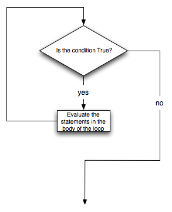

..  Copyright (C)  Brad Miller, David Ranum, Jeffrey Elkner, Peter Wentworth, Allen B. Downey, Chris
    Meyers, and Dario Mitchell.  Permission is granted to copy, distribute
    and/or modify this document under the terms of the GNU Free Documentation
    License, Version 1.3 or any later version published by the Free Software
    Foundation; with Invariant Sections being Forward, Prefaces, and
    Contributor List, no Front-Cover Texts, and no Back-Cover Texts.  A copy of
    the license is included in the section entitled "GNU Free Documentation
    License".

.. qnum::
   :prefix: iter-3-
   :start: 1

The ``while`` Statement
-----------------------

.. youtube:: 3SXQOYf27bU
    :divid: whileloop
    :height: 315
    :width: 560
    :align: left

.. Video notes:

.. Demonstrate program:

.. num = 0
.. while num < 3:
..     print(num, '...')
..     num = num + 1

.. print("All done!")

.. Use CodeLens to step through
.. Show how initializing num = 3 means loop doesn't execute at all
.. Show how Changing num = num - 1 introduces infinite loop

.. Develop the following program

.. import random

.. secret = int(input('Enter a number for the computer to guess.')) 
.. num = random.randint(0, 10)
.. guesses = 0
.. while num != secret:
..     print(num, '...')
..     num = random.randint(0, 10)
..     guesses += 1

.. print(num, '...')
.. print("Got it! It took me", guesses, "guesses.")

In addition to the ``for`` statement, there is another Python statement that can also be used to build an iteration.  It is called the ``while`` statement.
The ``while`` statement provides a much more general mechanism for iterating.  Similar to the ``if`` statement, it uses
a boolean condition to control the flow of execution.  The body of while will be repeated as long as the controlling boolean expression evaluates to ``True``.

Here's a program that counts down from 10 to 1 using a ``while`` statement:

.. activecode:: while_countdown
    :nocanvas:

    num = 5
    while num > 0:
        print(num, '...')
        num = num - 1

To understand this, use **Show CodeLens** to step through the code and watch the flow of control.

The following figure shows the flow of control.

More formally, here is the flow of execution for a ``while`` statement:

#. Evaluate the condition, yielding ``False`` or ``True``.
#. If the condition is ``False``, exit the ``while`` statement and continue
   execution at the next statement.
#. If the condition is ``True``, execute each of the statements in the body and
   then go back to step 1.

The body consists of all of the statements below the header with the same
indentation.

This type of flow is called a **loop** because the third step loops back around
to the top. Notice that if the condition is ``False`` the first time through the
loop, the statements inside the loop are never executed.

.. warning::
   Though Python's ``while`` is very close to the English "while",
   there is an important difference:  In English "while X, do Y",
   we usually assume that immediately after X becomes false, we stop
   with Y.  In Python there is *not* an immediate stop:  After the
   initial test, any following tests come only after the execution of
   the *whole* body, even if the condition becomes false in the middle of the loop body.

The body of the loop should change the value of one or more variables so that
eventually the condition becomes ``False`` and the loop terminates. Otherwise the
loop will repeat forever. This is called an **infinite loop**.
An endless
source of amusement for computer scientists is the observation that the
directions written on the back of the shampoo bottle (lather, rinse, repeat) create an infinite loop.

In the case shown above, we can prove that the loop terminates because we
know that the value of ``aBound`` is finite, and we can see that the value of ``aNumber``
increments each time through the loop, so eventually it will have to exceed ``aBound``. In
other cases, it is not so easy to tell.

.. note::

	Introduction of the while statement causes us to think about the types of iteration we have seen.  The ``for``
	statement will always iterate through a sequence of values like the list of names for the party or the list of
	numbers created by ``range``.  Since we know that it will iterate once for each value in the collection, it is often
	said that a ``for`` loop creates a **definite iteration** because we definitely know how many times we are going to
	iterate.  On the other hand, the ``while`` statement is dependent on a condition that needs to evaluate to ``False``
	in order for the loop to terminate.  Since we do not necessarily know when this will happen, it creates what we call
	**indefinite iteration**.  Indefinite iteration simply means that we don't know how many times we will repeat but
	eventually the condition controlling the iteration will fail and the iteration will stop. (Unless we have an
	infinite loop which is of course a problem.)

We can use the ``while`` loop to create any type of iteration we wish, including anything that we a ``for`` loop can do. For example, consider this program
that sums up the numbers from 1 to 10 using a ``for`` loop:

.. sourcecode:: python

    sumTo = 10
    theSum = 0
    for aNumber in range(1, sumTo + 1):
        theSum = theSum + aNumber

    print('The sum from 1 to', sumTo,' is:', theSum)

This program uses the Accumulator Pattern to gradually accumulate the sum in ``theSum``. See if you can rewrite it using a
``while`` loop:

.. tabbed:: while_sumup_tabbed

    .. tab:: Question        
        
        Complete the program below to sum the numbers from 1 to ``sumTo``. 

        .. activecode:: while_sumup_ac

            sumTo = 10
            theSum = 0
            aNumber = 0
            
            # Write a while loop here 

            print('The sum from 1 to', sumTo,' is:', theSum)

    .. tab:: Solution

        Here's the solution.

        .. sourcecode:: python

            sumTo = 10
            theSum = 0
            aNumber = 0
            while aNumber <= sumTo:
                theSum = theSum + aNumber
                aNumber = aNumber + 1

What you will notice here is that the ``while`` loop is more work for
you --- the programmer --- than the equivalent ``for`` loop.  When using a ``while``
loop you have to control the loop variable yourself.  You give it an initial value, test
for completion, and then make sure you change something in the body so that the loop
terminates.

So why have two kinds of loop if ``for`` looks easier?  The next section, :ref:`randomly-walking-turtles`, shows an indefinite iteration where
we need the extra power that we get from the ``while`` loop.

**Check your understanding**

.. mchoice:: test_question7_2_1
   :practice: T
   :answer_a: True
   :answer_b: False
   :correct: a
   :feedback_a: Although the while loop uses a different syntax, it is just as powerful as a for-loop and often more flexible.
   :feedback_b: Often a for-loop is more natural and convenient for a task, but that same task can always be expressed using a while loop.

   True or False: You can rewrite any for-loop as a while-loop.

.. mchoice:: test_question7_2_2
   :practice: T
   :answer_a: n starts at 10 and is incremented by 1 each time through the loop, so it will always be positive
   :answer_b: answer starts at 1 and is incremented by n each time, so it will always be positive
   :answer_c: You cannot compare n to 0 in while loop.  You must compare it to another variable.
   :answer_d: In the while loop body, we must set n to False, and this code does not do that.
   :correct: a
   :feedback_a: The loop will run as long as n is positive.  In this case, we can see that n will never become non-positive.
   :feedback_b: While it is true that answer will always be positive, answer is not considered in the loop condition.
   :feedback_c: It is perfectly valid to compare n to 0.  Though indirectly, this is what causes the infinite loop.
   :feedback_d: The loop condition must become False for the loop to terminate, but n by itself is not the condition in this case.

   The following code contains an infinite loop.  Which is the best explanation for why the loop does not terminate?

   .. code-block:: python

     n = 10
     answer = 1
     while n > 0:
         answer = answer + n
         n = n + 1
     print(answer)

.. mchoice:: test_question7_2_3
   :practice: T
   :answer_a: 4 7
   :answer_b: 5 7
   :answer_c: 7 15
   :correct: c
   :feedback_a: Setting a variable so the loop condition would be false in the middle of the loop body does not keep the variable from actually being set.
   :feedback_b: Setting a variable so the loop condition would be false in the middle of the loop body does not stop execution of statements in the rest of the loop body.
   :feedback_c: After n becomes 5 and the test would be False, but the test does not actually come until after the end of the loop - only then stopping execution of the repetition of the loop.

   What is printed by this code?

   .. code-block:: python

     n = 1
     x = 2
     while n < 5:
         n = n + 1
         x = x + 1
         n = n + 2
         x = x + n
     print(n, x)
