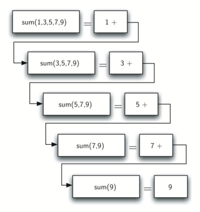

..  Copyright (C)  Brad Miller, David Ranum, Jeffrey Elkner, Peter Wentworth, Allen B. Downey, Chris
    Meyers, and Dario Mitchell.  Permission is granted to copy, distribute
    and/or modify this document under the terms of the GNU Free Documentation
    License, Version 1.3 or any later version published by the Free Software
    Foundation; with Invariant Sections being Forward, Prefaces, and
    Contributor List, no Front-Cover Texts, and no Back-Cover Texts.  A copy of
    the license is included in the section entitled "GNU Free Documentation
    License".

Calculating the Sum of a List of Numbers
~~~~~~~~~~~~~~~~~~~~~~~~~~~~~~~~~~~~~~~~

We will begin our investigation with a simple problem that you already
know how to solve without using recursion. Suppose that you want to
calculate the sum of a list of numbers such as:
:math:`[1, 3, 5, 7, 9]`. An iterative function that computes the sum
is shown below. The function uses an accumulator variable
(``theSum``) to compute a running total of all the numbers in the list
by starting with :math:`0` and adding each number in the list.

.. activecode:: lst_itsum
    :caption: Iterative Summation

    def listsum(numList):
        theSum = 0
        for i in numList:
            theSum = theSum + i
        return theSum
        
    print(listsum([1,3,5,7,9]))

Pretend for a minute that you do not have ``while`` loops or ``for``
loops. How would you compute the sum of a list of numbers? If you were a
mathematician you might start by recalling that addition is a function
that is defined for two parameters, a pair of numbers. To redefine the
problem from adding a list to adding pairs of numbers, we could rewrite
the list as a fully parenthesized expression. Such an expression looks
like this: 

.. math::
    ((((1 + 3) + 5) + 7) + 9)
    
We can also parenthesize
the expression the other way around,

.. math::

     (1 + (3 + (5 + (7 + 9)))) 

Notice that the innermost set of
parentheses, :math:`(7 + 9)`, is a problem that we can solve without a
loop or any special constructs. In fact, we can use the following
sequence of simplifications to compute a final sum.

.. math::

    total = \  (1 + (3 + (5 + (7 + 9)))) \\
    total = \  (1 + (3 + (5 + 16))) \\
    total = \  (1 + (3 + 21)) \\
    total = \  (1 + 24) \\
    total = \  25

How can we take this idea and turn it into a Python program? First,
let’s restate the sum problem in terms of Python lists. We might say the
the sum of the list ``numList`` is the sum of the first element of the
list (``numList[0]``), and the sum of the numbers in the rest of the
list (``numList[1:]``). To state it in a mathematical form:

.. math::

      listSum(numList) = first(numList) + listSum(rest(numList))
    \label{eqn:listsum}

In this equation :math:`first(numList)` returns the first element of
the list and :math:`rest(numList)` returns a list of everything but
the first element. 

This is an example of a recursive definition. A **recursive definition** uses the term being defined in its own
definition. In this case, we're defining a function, ``listSum``, and its definition uses the ``listSum`` function. 

When you define words in a dictionary, you avoid using the word being defined in its own definition. However, in
mathematics, this can be a useful technique, as long as it is applied correctly. The recursive definition above is a
good start, but there is a problem with it: it does not specify the "ending point" for the recursion. Let's address the
problem by refining the definition as follows:

.. math::

    listSum(numList) = \left\{
        \begin{array}{lr}
            first(numList) & \text{if } len(numList) = 1\\
            first(numList) + listSum(rest(numList)) & \text{if } len(numList) >  1
        \end{array}
        \right.

This version of the definition has two cases:

#. The **base case** (a list with one element). The result of invoking ``listSum`` on a list with one element is
   defined to be the first number in the list.

#. The **recursive case** (a list with more than one element). The result of invoking ``listSum`` on a list with
   more than one element is defined to be the sum of the first element in the list, and whatever ``listSum``
   produces when given the rest of the list.

This definition can be implemented in Python as follows:

.. activecode:: lst_recsum
    :caption: Recursive Summation

    def listsum(numList):
       if len(numList) == 1:
            return numList[0]
       else:
            return numList[0] + listsum(numList[1:])
            
    print(listsum([1,3,5,7,9]))

There are a few key ideas in this listing to look at. First, on line 2 we are checking to see if the list is one element long. This
check is crucial and is our escape clause from the function. The sum of
a list of length 1 is trivial; it is just the number in the list.
Second, on line 5 our function calls itself! This is the
reason that we call the ``listsum`` algorithm recursive. A recursive
function is a function that calls itself.

:ref:`Figure 1 <fig_recsumin>` shows the series of **recursive calls** that are
needed to sum the list :math:`[1, 3, 5, 7, 9]`. You should think of
this series of calls as a series of simplifications. Each time we make a
recursive call we are solving a smaller problem, until we reach the
point where the problem cannot get any smaller.

.. _fig_recsumin:

   Figure 1: Series of Recursive Calls Adding a List of Numbers

When we reach the point where the problem is as simple as it can get, we
begin to piece together the solutions of each of the small problems
until the initial problem is solved. :ref:`Figure 2 <fig_recsumout>` shows the
additions that are performed as ``listsum`` works its way backward
through the series of calls. When ``listsum`` returns from the topmost
problem, we have the solution to the whole problem.

.. _fig_recsumout:

.. figure:: Figures/sumlistOut.png
   :align: center
   :alt: image

   Figure 2: Series of Recursive Returns from Adding a List of Numbers

**Check your understanding**

.. mchoice:: question_recsimp_1
   :practice: T
   :correct: c
   :answer_a: 6
   :answer_b: 5
   :answer_c: 4
   :answer_d: 3
   :feedback_a: There are only five numbers on the list, the number of recursive calls will not be greater than the size of the list.
   :feedback_b: The initial call to listsum is not a recursive call.
   :feedback_c: the first recursive call passes the list [4,6,8,10], the second [6,8,10] and so on until [10].
   :feedback_d: This would not be enough calls to cover all the numbers on the list

   In the listsum example above, how many recursive calls are made when computing the sum of the list [2,4,6,8,10]?

.. tabbed:: tabbed_refine_recmathfunc

    .. tab:: Question

        1. The listsum function presented above has an important limitation: it doesn't work
           correctly if given an empty list (try editing the code above to pass an empty list to
           listsum and see what happens in that case). 

           Revise the mathematical definition above so that it takes an empty list into account.

    .. tab:: Solution

        There are a couple of possible solutions. We could simply add another case to the
        function definition to handle an empty list, like this:

        .. math::

            listSum(nums) = \left\{
                \begin{array}{lr}
                    0 & \text{if } len(nums) = 0\\
                    first(nums) & \text{if } len(nums) = 1\\
                    first(nums) + listSum(rest(nums)) & \text{if } len(nums) > 1
                \end{array}
                \right.

        However, two base cases are unnecessary. The function will work correctly with just
        one:

        .. math::

            listSum(nums) = \left\{
                \begin{array}{lr}
                    0 & \text{if } len(nums) = 0\\
                    first(nums) + listSum(rest(nums)) & \text{if } len(nums) > 0
                \end{array}
                \right.

.. tabbed:: tabbed_refine_listsum

    .. tab:: Question

        2. Using the solution to the previous question as a guide, revise the listsum function so that it
           works correctly for empty lists.

        .. activecode:: ac_refine_listsum
            :autograde: unittest

            def listsum(numList):
                if len(numList) == 1:
                    return numList[0]
                else:
                    return numList[0] + listsum(numList[1:])
                        
            print(listsum([1,3,5,7,9]))
            print(listsum([]))

            ====

            from unittest.gui import TestCaseGui
            class myTests(TestCaseGui):
                def testOne(self):
                    self.assertEqual(listsum([1,3,5,7,9]),25,'Tested listsum on input of [1,3,5,7,9]')
                    self.assertEqual(listsum([3]),3,'Tested listsum on input of [3]')
                    self.assertEqual(listsum([]),0,'Tested listsum on input of []')

            myTests().main()

    .. tab:: Solution

        Here is the solution::

            def listsum(numList):
                if len(numList) == 0:
                    return 0
                else:
                    return numList[0] + listsum(numList[1:])
