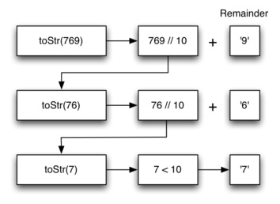

..  Copyright (C)  Brad Miller, David Ranum, Jeffrey Elkner, Peter Wentworth, Allen B. Downey, Chris
    Meyers, and Dario Mitchell.  Permission is granted to copy, distribute
    and/or modify this document under the terms of the GNU Free Documentation
    License, Version 1.3 or any later version published by the Free Software
    Foundation; with Invariant Sections being Forward, Prefaces, and
    Contributor List, no Front-Cover Texts, and no Back-Cover Texts.  A copy of
    the license is included in the section entitled "GNU Free Documentation
    License".

.. qnum::
   :prefix: rec-4-
   :start: 1

Converting an Integer to a String in Any Base
~~~~~~~~~~~~~~~~~~~~~~~~~~~~~~~~~~~~~~~~~~~~~

Suppose you want to convert an integer to a string in some base between
binary and hexadecimal. For example, convert the integer 10 to its
string representation in decimal as ``"10"``, or to its string
representation in binary as ``"1010"``. While there are many approaches one
can take
to solve this problem, the recursive formulation of the problem is very
elegant.

Let’s look at a concrete example using base 10 and the number 769.
Suppose we have a sequence of characters corresponding to the first 10
digits, like ``convString = "0123456789"``. It is easy to convert a
number less than 10 to its string equivalent by looking it up in the
sequence. For example, if the number is 9, then the string is
``convString[9]`` or ``"9"``. If we can arrange to break up the number
769 into three single-digit numbers, 7, 6, and 9, then converting it to
a string is simple. A number less than 10 sounds like a good base case.

Knowing what our base is suggests that the overall algorithm will
involve three components:

#. Reduce the original number to a series of single-digit numbers.

#. Convert the single digit-number to a string using a lookup.

#. Concatenate the single-digit strings together to form the final
   result.

The next step is to figure out how to change state and make progress
toward the base case. Since we are working with an integer, let’s
consider what mathematical operations might reduce a number. The most
likely candidates are division and subtraction. While subtraction might
work, it is unclear what we should subtract from what. Integer division
with remainders gives us a clear direction. Let’s look at what happens
if we divide a number by the base we are trying to convert to.

Using integer division to divide 769 by 10, we get 76 with a remainder
of 9. This gives us two good results. First, the remainder is a number
less than our base that can be converted to a string immediately by
lookup. Second, we get a number that is smaller than our original and
moves us toward the base case of having a single number less than our
base. Now our job is to convert 76 to its string representation. Again
we will use integer division plus remainder to get results of 7 and 6
respectively. Finally, we have reduced the problem to converting 7,
which we can do easily since it satisfies the base case condition of
:math:`n < base`, where :math:`base = 10`. The series of operations
we have just performed is illustrated in :ref:`Figure 3 <fig_tostr>`. Notice that
the numbers we want to remember are in the remainder boxes along the
right side of the diagram.

.. _fig_tostr:

   Figure 3: Converting an Integer to a String in Base 10

The activecode below shows the Python code that implements the algorithm
outlined above for any base between 2 and 16.

.. activecode:: lst_rectostr
    :caption: Recursively Converting from Integer to String

    def toStr(n,base):
       convertString = "0123456789ABCDEF"
       if n < base:
          return convertString[n]
       else:
          return toStr(n//base,base) + convertString[n%base]

    print(toStr(1453,16))

Notice that in line 3 we check for the base case where ``n``
is less than the base we are converting to. When we detect the base
case, we stop recursing and simply return the string from the
``convertString`` sequence. In line 6 we satisfy both the
second and third laws–by making the recursive call and by reducing the
problem size–using division.

Let’s trace the algorithm again; this time we will convert the number 10
to its base 2 string representation (``"1010"``).

.. _fig_tostr2:

.. figure:: Figures/toStrBase2.png
   :align: center
   :alt: image

   Figure 4: Converting the Number 10 to its Base 2 String Representation

:ref:`Figure 4 <fig_tostr2>` shows that we get the results we are looking for,
but it looks like the digits are in the wrong order. The algorithm works
correctly because we make the recursive call first on line
6, then we add the string representation of the remainder.
If we reversed returning the ``convertString`` lookup and returning the
``toStr`` call, the resulting string would be backward! But by delaying
the concatenation operation until after the recursive call has returned,
we get the result in the proper order.

**Check your understanding**

.. tabbed:: tabbed_recursion_sc_1

   .. tab:: Question

      1. Write a function ``reverse`` that takes a string as a parameter and returns a new string that is the reverse of the old string.

      .. activecode:: recursion_sc_1
         :autograde: unittest

         def reverse(s):
            return s

         ====

         from unittest.gui import TestCaseGui
         class myTests(TestCaseGui):
               def testOne(self):
                  self.assertEqual(reverse("hello"),"olleh",'Tested reverse("hello")')
                  self.assertEqual(reverse("l"),"l",'Tested reverse("l")')
                  self.assertEqual(reverse("follow"),"wollof",'Tested reverse("follow")')
                  self.assertEqual(reverse(""),"",'Tested reverse("")')

         myTests().main()

   .. tab:: Tip

      Here are a couple of tips that may help:

      1. Here's a recursive definition in English: "The reverse of a string is the reverse of the 'rest of' the string, followed by the first character of the string."

      2. The solution to this problem looks a lot like the listsum function presented earlier in this chapter.

   .. tab:: Answer

      The reverse of a string is the reverse of the "rest of" the string, followed by the first character of the string.
      
      Here is the solution::

         def reverse(s):
            if len(s) == 0:
               return ""
            else:
               return reverse(s[1:]) + s[0]

.. tabbed:: tabbed_recursion_sc_2

   .. tab:: Question

      2. Write a function ``isPal`` that takes a string as a parameter and returns True if the string is a palindrome,
      False otherwise.  A string is a palindrome if it is spelled the same both forward and backward. For example:
      radar" is a palindrome. 
      
      Palindromes can also be phrases, but you need to remove the spaces and punctuation and normalize the
      capitalization before checking.  For example: "Madam, I'm Adam"  is a palindrome, if you remove spaces and
      punctuation, and convert everything to lowercase. For full credit, write code in the function ``normalize`` to
      return a copy of *s* with all characters that are not letters stripped out. If you're feeling adventurous, make
      ``normalize`` a recursive function.
      
      Other fun palindromes include:
      
      * kayak
      * aibohphobia
      * Live not on evil
      * Reviled did I live, said I, as evil I did deliver
      * Go hang a salami; I'm a lasagna hog.
      * Able was I ere I saw Elba
      * Kanakanak --  a town in Alaska
      * Wassamassaw -- a town in South Dakota

      .. activecode:: recursion_sc_2

         def normalize(s):
            return s

         def isPal(s):
            return False

         ====

         from unittest.gui import TestCaseGui
         class myTests(TestCaseGui):
               def testOne(self):
                  self.assertTrue(isPal(normalize("x")),'Tested normalize(isPal("x"))')
                  self.assertTrue(isPal(normalize("radar")),'Tested normalize(isPal("radar"))')
                  self.assertTrue(not isPal(normalize("hello")),'Tested normalize(isPal("hello"))')
                  self.assertTrue(isPal(normalize("")),'Tested normalize(isPal(""))')
                  self.assertTrue(isPal(normalize("hannah")),'Tested normalize(isPal("hannah"))')
                  self.assertTrue(isPal(normalize("madam i'm adam")),'Tested normalize(isPal("madam i\'m adam"))')

         myTests().main()

   .. tab:: Answer

      Here's the answer::

         def normalize(s):
            if len(s) == 0:
               # Base case
               return s
            elif s[0].isalpha():
               # If the first character is a letter,
               # return a string with that letter followed by the
               # normalization of the rest of the string
               return s[0] + normalize(s[1:])
            else:
               # Otherwise,
               # Return the normalization of the rest of the string
               return normalize(s[1:])

         def isPal(s):
            if len(s) <= 1:
               # Base case: An empty string or a string with one letter is a palindrome
               return True
            else:
               # Return True if the first and last letters are the same,
               # and the rest of the string is a palindrome            
               return s[0] == s[len(s)-1] and isPal(s[1:-1])

