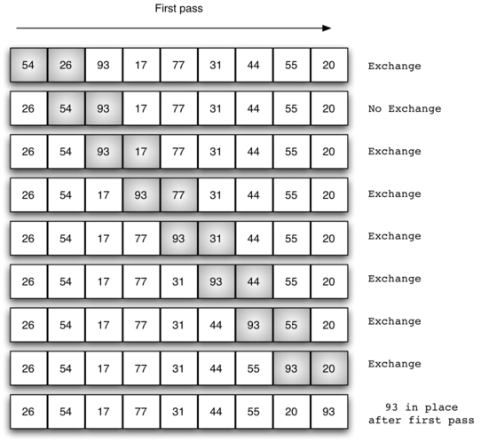

..  Copyright (C)  Brad Miller, David Ranum
    This work is licensed under the Creative Commons Attribution-NonCommercial-ShareAlike 4.0 International License. To view a copy of this license, visit http://creativecommons.org/licenses/by-nc-sa/4.0/.

The Bubble Sort
================

The **bubble sort** makes multiple passes through a list. It compares
adjacent items and exchanges those that are out of order. Each pass
through the list places the next largest value in its proper place. In
essence, each item “bubbles” up to the location where it belongs.

:ref:`Figure 1 <fig_bubblepass>` shows the first pass of a bubble sort. The shaded
items are being compared to see if they are out of order. If there are
*n* items in the list, then there are :math:`n-1` pairs of items that
need to be compared on the first pass. It is important to note that once
the largest value in the list is part of a pair, it will continually be
moved along until the pass is complete.

.. _fig_bubblepass:

   Figure 1: ``bubbleSort``: The First Pass

At the start of the second pass, the largest value is now in place.
There are :math:`n-1` items left to sort, meaning that there will be
:math:`n-2` pairs. Since each pass places the next largest value in
place, the total number of passes necessary will be :math:`n-1`. After
completing the :math:`n-1` passes, the smallest item must be in the
correct position with no further processing required. 

The following shows a ``bubbleSort`` function that implements the algorithm. It takes the list as a
parameter, and modifies it by exchanging items as necessary. Use the **Show CodeLens** button
to step through and understand the algorithm.

.. activecode:: lst_bubble
    :caption: The Bubble Sort

    def bubbleSort(alist):
        for passnum in range(len(alist)-1,0,-1):
            for i in range(passnum):
                if alist[i]>alist[i+1]:
                    temp = alist[i]
                    alist[i] = alist[i+1]
                    alist[i+1] = temp

    alist = [54,26,93,17,77,31,44,55,20]
    bubbleSort(alist)
    print(alist)

Lines 5-7 above perform an exchange of two items in the list. In most languages, the exchange operation, sometimes
called a “swap,” requires a temporary variable. A code fragment such as::

    temp = alist[i]
    alist[i] = alist[j]
    alist[j] = temp

will exchange the `ith` and `jth` items in the list. 

In Python, it is possible to perform simultaneous assignment. The
statement ``a, b = b, a`` will result in two assignment statements being
done at the same time. Using simultaneous
assignment, swapping the values in slots *i* and *j* of ``alist`` 
can be done in one statement, like this::

    alist[i], alist[j] = alist[j], alist[i]

:ref:`Figure 2 <fig_pythonswap>` illustrates the difference between the three-step
process and the direct swap possible in Python:

.. _fig_pythonswap:

.. figure:: Figures/swap.png
   :align: center

   Figure 2: Exchanging Two Values in Python

The following animation shows ``bubbleSort`` in action. To use it, first click Initialize to populate the list to be
sorted with values, represented by bars of various heights. Then use the Run button to run the algorithm and watch
how it swaps pairs of elements. You can use the other buttons to control the animation.

.. animation:: bubble_anim
   :modelfile: sortmodels.js
   :viewerfile: sortviewers.js
   :model: BubbleSortModel
   :viewer: BarViewer

Bubble Sort Performance Analysis
--------------------------------

To analyze the performance of the bubble sort, we should note that regardless of how the
items are arranged in the initial list, :math:`n-1` passes will be
made to sort a list of size *n*. :ref:`Table 1 <tbl_bubbleanalysis>` shows the number
of comparisons for each pass. The total number of comparisons is the sum
of the first :math:`n-1` integers. Recall that the sum of the first
*n* integers is :math:`\frac{1}{2}n^{2} + \frac{1}{2}n`. The sum of
the first :math:`n-1` integers is
:math:`\frac{1}{2}n^{2} + \frac{1}{2}n - n`, which is
:math:`\frac{1}{2}n^{2} - \frac{1}{2}n`. This is still
:math:`O(n^{2})` comparisons. In the best case, if the list is already
ordered, no exchanges will be made. However, in the worst case, every
comparison will cause an exchange. On average, we exchange half of the
time.

.. _tbl_bubbleanalysis:

.. table:: **Table 1: Comparisons for Each Pass of Bubble Sort**

    ================= ==================
    **Pass**          **Comparisons**
    ================= ==================
             1         :math:`n-1`
             2         :math:`n-2`
             3         :math:`n-3`
             ...       ...
       :math:`n-1`     :math:`1`
    ================= ==================

A bubble sort is often considered the most inefficient sorting method
since it must exchange items before the final location is known. These
“wasted” exchange operations are very costly. However, because the
bubble sort makes passes through the entire unsorted portion of the
list, it has the capability to do something most sorting algorithms
cannot. In particular, if during a pass there are no exchanges, then we
know that the list must be sorted. A bubble sort can be modified to stop
early if it finds that the list has become sorted. This means that for
lists that require just a few passes, a bubble sort may have an
advantage in that it will recognize the sorted list and stop.
The following shows this modification, which is often referred
to as the **short bubble**.

.. activecode:: lst_shortbubble
    :caption: The Short Bubble Sort

    def shortBubbleSort(alist):
        exchanges = True
        passnum = len(alist)-1
        while passnum > 0 and exchanges:
           exchanges = False
           for i in range(passnum):
               if alist[i]>alist[i+1]:
                   exchanges = True
                   temp = alist[i]
                   alist[i] = alist[i+1]
                   alist[i+1] = temp
           passnum = passnum-1

    alist=[20,30,40,90,50,60,70,80,100,110]
    shortBubbleSort(alist)
    print(alist)

The short bubble version of the algorithm has performance :math:`O(n)` when the list is already sorted, because it
performs only :math:`n` comparisons and no exchanges.
 
**Check your understanding**

.. mchoice:: question_sort_1
    :correct: b
    :answer_a: [1, 9, 19, 7, 3, 10, 13, 15, 8, 12]
    :answer_b: [1, 3, 7, 9, 10, 8, 12, 13, 15, 19]
    :answer_c: [1, 7, 3, 9, 10, 13, 8, 12, 15, 19]
    :answer_d: [1, 9, 19, 7, 3, 10, 13, 15, 8, 12]
    :feedback_a:  This answer represents three swaps.  A pass means that you continue swapping all the way to the end of the list.
    :feedback_b:  Very Good
    :feedback_c: A bubble sort contines to swap numbers up to index position passnum.  But remember that passnum starts at the length of the list - 1.
    :feedback_d: You have been doing an insertion sort, not a bubble sort.

    Suppose you have the following list of numbers to sort: [19, 1, 9, 7, 3, 10, 13, 15, 8, 12]. Which list represents the partially sorted list after three complete passes of bubble sort?

